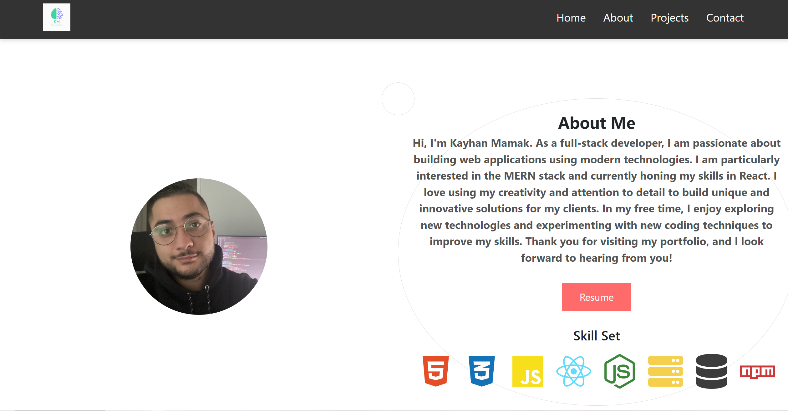
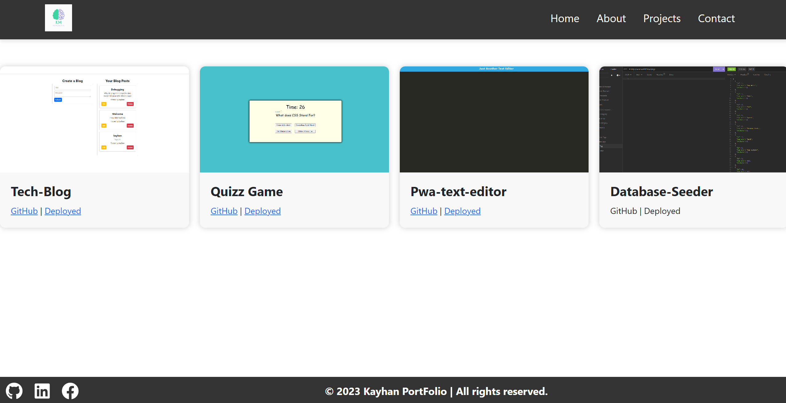
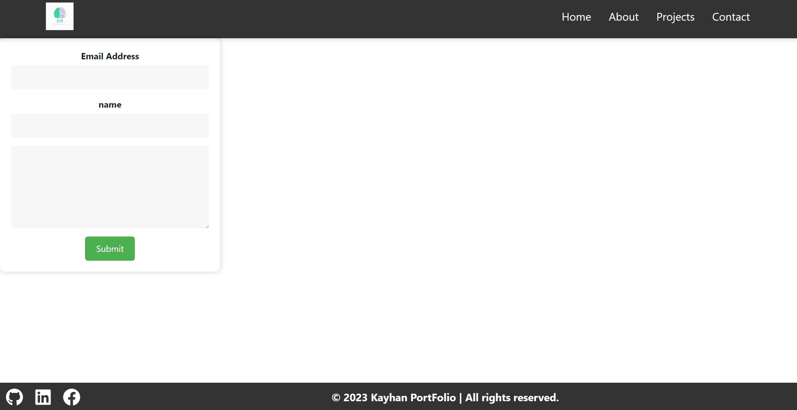

# React-Portfolio

## Description

This project is a portfolio website created using React that showcases my web development projects and skills. The website features a header, a section for content, and a footer. The header includes my name and a navigation menu with titles corresponding to different sections of the portfolio. The navigation titles include About Me, Portfolio, Contact, and Resume, and the title corresponding to the current section is highlighted. Clicking on a navigation title displays the corresponding section without reloading the page. The website is designed using a mobile-first approach and a color palette that distinguishes it from default Bootstrap themes and unstyled HTML sites.

## Technologies Used:

- React
- JavaScript
- HTML
- CSS

## Installation

To run this project, you will need to have Node.js installed on your computer. Once you have Node.js installed, follow these steps:

1. Clone the repository to your local machine.
2. Open a terminal window and navigate to the project directory.
3. Run the command npm install to install the project dependencies.
4. Run the command npm start to start the development server.

## Tests

This project currently does not have any automated tests.

## Usage

To use this project, simply navigate to the deployed website and use the navigation menu to browse the different sections of the portfolio.

## Contact-Details

- Email: kayhanturk90@live.com
- Linkedln: Kayhan Mamak
